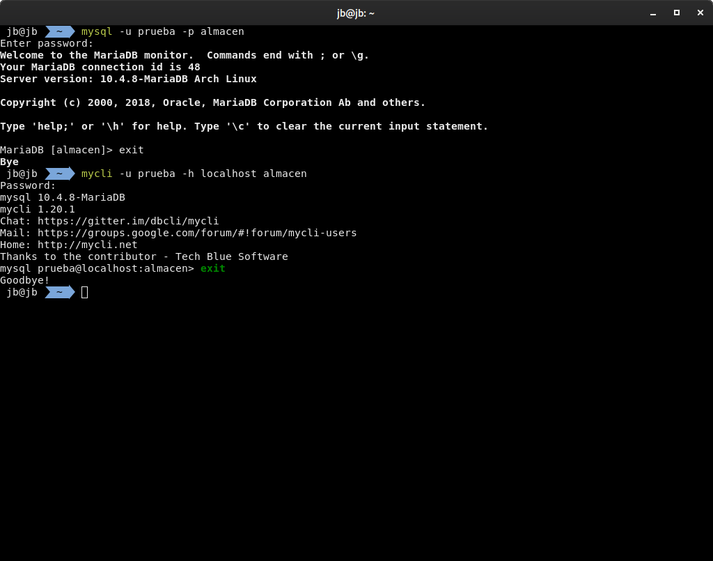

CONECTARSE A MYSQL
```
mysql -u usuario -p nombre base de datos
mycli -u usuario -p direccion(localhost) nombre base de datos
```

CREAR BBDD
```sql
CREATE DATABASE almacen;
```
CREAR USUARIO Y DAR PRIVILEGIOS
```sql
CREATE USER 'usuario'@'localhost' IDENTIFIED BY 'contraseña';
GRANT ALL PRIVILEGES ON *.* TO 'admin'@'localhost' WITH GRANT OPTION;
FLUSH PRIVILEGES;
```
usar la base de datos 
```sql
USE almacen;
```
como saber las bases de datos que hay
```sql
SELECT DATABASE();
```

To import database from local *.sql file:
```
mysql -u user_name -p database_name < dump.sql
```

To export database to local *.sql file:
```
mysqldump -u user_name -p database_name > dump.sql
```
